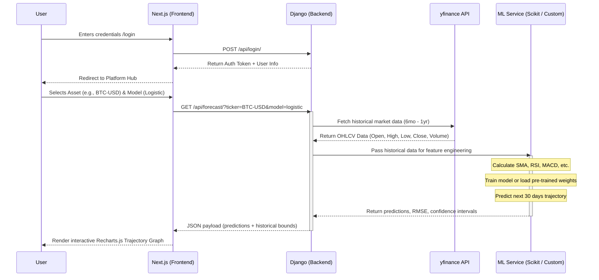

# StockCompass

StockCompass is a comprehensive, AI-powered stock analysis platform featuring curated industry portfolios, stock clustering, and predictive trajectory forecasting using machine learning models.

The project is divided into a **Django** backend that handles data fetching, ML modeling, and API endpoints, alongside a **Next.js** frontend showcasing a modern, glassmorphic UI.

## Prerequisites

Before you begin, ensure you have the following installed on your machine:
- [Node.js](https://nodejs.org/) (v16.x or higher)
- npm or yarn
- [Python](https://www.python.org/) 3.10+
- Git

---

## 🚀 Getting Started

### 1. Backend Setup (Django + Python)

The backend exposes the core API, handles stock data retrieval (via yfinance), and runs the predictive models.

1. **Navigate to the backend directory:**
   ```bash
   cd backend
   ```

2. **Create and activate a virtual environment:**
   - **Windows:**
     ```bash
     python -m venv venv
     venv\Scripts\activate
     ```
   - **macOS/Linux:**
     ```bash
     python3 -m venv venv
     source venv/bin/activate
     ```

3. **Install the required Python dependencies:**
   ```bash
   pip install -r requirements.txt
   ```

4. **Apply database migrations:**
   ```bash
   python manage.py migrate
   ```

5. **Start the Django development server:**
   ```bash
   python manage.py runserver
   ```
   *The backend API will now be running on `http://127.0.0.1:8000/`*

---

### 2. Frontend Setup (Next.js + React)

The frontend contains the interactive dashboards, beautiful UI components, and authentication forms.

1. **Navigate to the frontend directory:**
   ```bash
   cd frontend
   ```

2. **Install node dependencies:**
   ```bash
   npm install
   # or
   yarn install
   ```

3. **Configure Environment Variables:**
   You must set up environment variables for the frontend to know where the backend API is hosted.
   - Copy the provided `.env.example` file to create a `.env.local` file:
     ```bash
     cp .env.example .env.local
     ```
   - Ensure the `.env.local` file contains the following variable pointing to your local Django server:
     ```env
     NEXT_PUBLIC_API_URL=http://127.0.0.1:8000/api
     ```

4. **Start the Next.js development server:**
   ```bash
   npm run dev
   # or
   yarn dev
   ```
   *The frontend application will now be accessible at `http://localhost:3000/` (or the port specified by Next.js, e.g., 9002).*

---

## Environment Variables (.env)
The frontend uses environment variables to dictate base paths for API requests.

**Frontend (`frontend/.env.local`)**
- `NEXT_PUBLIC_API_URL`: The root URL attached to all backend API calls (e.g., login, registering, fetching trajectory datasets). When running locally, this should always be `http://127.0.0.1:8000/api`.

*(If any backend specific environment variables are introduced later—such as database URLs or secret keys—they should be configured in a `.env` file inside the `backend/` folder).*

---

## Running Full Stack Locally
To run the full stack during development, you will need to open **two separate terminal windows/tabs**:
1. One running the backend (`python manage.py runserver`).
2. One running the frontend (`npm run dev`).

Navigate to the frontend URL in your browser to start exploring StockCompass!

---

## Architecture & Application Flow

The following sequence diagram outlines how the **Next.js Frontend**, **Django Backend**, and **External Data Providers** interact during a standard analysis request (e.g., fetching a predictive trajectory model):


